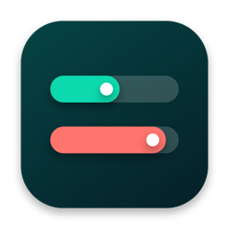

<p align="center">
  
</p>

# Sub2API Monitor

A small native macOS menu bar app for monitoring Sub2API account usage. It
shows the selected account's 5-hour and 7-day utilization at a glance, while
the menu contains usage details for every account discovered by the server.

Sub2API Monitor is written in Swift and AppKit. It does not depend on SwiftBar
or any third-party runtime.

## Features

- Displays `5h · 7d` utilization directly in the menu bar
- Discovers and lists every Sub2API account automatically
- Switches the account shown in the menu bar with one click
- Shows requests, tokens, cost, and reset time when available
- Refreshes every 30 seconds and after the Mac wakes from sleep
- Supports normal refresh and forced upstream refresh
- Stores the Admin API Key in macOS Keychain
- Requires HTTPS for remote servers; HTTP is allowed only for localhost

## Requirements

- macOS 13 Ventura or later
- A reachable Sub2API deployment
- The Admin API Key configured for that deployment

The downloadable `v1.0.0` app is built for Apple Silicon (`arm64`). Intel Mac
users can build the app from source on their machine.

## Install a release

1. Download `Sub2API-Monitor-v1.0.0-macos-arm64.zip` from
   [Releases](https://github.com/popsc30/sub2api-monitor/releases).
2. Unzip it and move **Sub2API Monitor.app** to `/Applications`.
3. On first launch, Control-click the app in Finder and choose **Open**.

The release is ad-hoc signed because it is not distributed with an Apple
Developer ID certificate. macOS may ask you to confirm the first launch.

## Configure

Open **Sub2API Monitor** from `/Applications`, or choose **Settings...** from
its menu bar menu. Enter:

- **Server URL:** the root URL of the Sub2API deployment, for example
  `https://sub2api.example.com`
- **Admin API Key:** the admin key configured by the Sub2API administrator

The key is stored in macOS Keychain and is not written to preferences or a
configuration file. Leaving the key field blank later keeps the stored key.

The app automatically loads all accounts. Clicking an account in the menu
changes only which account's `5h · 7d` values appear in the menu bar.

## Build from source

Install the Xcode Command Line Tools, then run:

```sh
git clone git@github.com:popsc30/sub2api-monitor.git
cd sub2api-monitor
xcrun swift run Sub2APIMonitorCoreChecks
./scripts/package.sh
```

The packaged application is written to:

```text
build/Sub2API Monitor.app
```

To install and launch it:

```sh
./scripts/install.sh
```

To run a strict release compilation manually:

```sh
xcrun swift build -c release -Xswiftc -warnings-as-errors
```

## Create a release archive

```sh
./scripts/release.sh 1.0.0
```

The release archive and checksum are written to `dist/`. The script builds the
app, verifies its signature, detects the binary architecture, and creates a
macOS resource-preserving ZIP archive.

## API access

Sub2API Monitor reads:

- `GET /api/v1/admin/accounts`
- `POST /api/v1/admin/accounts/usage/batch`

The Admin API Key is sent only to the configured server using the `X-API-Key`
header. The app does not include analytics or send account data elsewhere.

## License

[MIT](LICENSE)
